<div align="center">


<a href="https://anastanveer.com">
  
</a>

<br/>


[](https://anastanveer.com)
[](https://www.linkedin.com/in/anas-fullstackdev/)
[](https://wa.me/971542435418)
[](mailto:info@anastanveer.com)

</div>


##  About This Project

> A **premium static portfolio website** built for **Anas Tanveer** — a Dubai-based full-stack web developer specializing in **Laravel, WordPress, Shopify, ERP systems, API integrations, dashboards, and SEO-ready business solutions**.

<div align="center">

<table>
<tr>
<td align="center" width="33%">

<br/><b>⚡ Lightning Fast</b>
<br/><sub>Static export, optimized assets</sub>
</td>
<td align="center" width="33%">

<br/><b>🎨 Premium Design</b>
<br/><sub>Animated, smooth, modern UI</sub>
</td>
<td align="center" width="33%">

<br/><b>🚀 SEO Ready</b>
<br/><sub>JSON-LD, sitemap, schema</sub>
</td>
</tr>
</table>

</div>


##  Built For

<div align="center">

| 🎯 Audience | 💼 Purpose |
|:---:|:---:|
| 🤝 **Direct Business Clients** | Showcase services & expertise |
| 👔 **Recruiters & HR Teams** | Resume + portfolio in one place |
| 🏢 **Agencies** | Subcontracting & partnerships |
| 💎 **Fiverr / Freelance Visitors** | Convert to paid clients |
| 🔗 **LinkedIn Visitors** | Professional brand presence |
| 🌍 **UAE / UK / Canada Leads** | International project pipeline |

</div>


##  Tech Stack

<div align="center">

### 🧠 Core Framework


### 🎨 Styling & Animation


### 🚀 SEO & Performance


### 🛡️ Hosting & Security


</div>


##  Local Development

```bash
# 📦 Install dependencies
npm install

# 🚀 Run dev server
npm run dev
```

Then open: **`http://localhost:3000`**

> ⚠️ **Important:** Do not open `.tsx`, `.js`, or source files directly in the browser. This is a Next.js project and must be served through the dev server or built export.


##  Production Build

```bash
# 🏗️ Build static production export
npm run build
```

The final deployable folder is:

```
out/
```

Upload the **contents inside `out/`** to Namecheap `public_html`. ❌ Do not upload the `out` folder itself.

✅ **Correct hosting structure:**

```
public_html/
├── index.html
├── .htaccess
├── robots.txt
├── sitemap.xml
├── _next/
├── images/
└── files/
```


##  Namecheap Deployment

<details>
<summary><b>🔽 Click to expand step-by-step deployment guide</b></summary>

<br/>

| Step | Action |
|:---:|:---|
| **1️⃣** | Run `npm run build` |
| **2️⃣** | Open the `out/` folder |
| **3️⃣** | Select all files **inside** `out/` |
| **4️⃣** | Create a ZIP from those selected contents |
| **5️⃣** | Open Namecheap cPanel File Manager |
| **6️⃣** | Go to `public_html` |
| **7️⃣** | Enable "Show Hidden Files" so `.htaccess` is visible |
| **8️⃣** | Upload the ZIP |
| **9️⃣** | Extract it directly inside `public_html` |
| **🔟** | Confirm `public_html/index.html` exists ✅ |

> 🔁 For future updates, repeat the same process after running `npm run build`.

</details>


##  Static Export Configuration

This project is configured for **pure static hosting**:

```js
output: "export"
trailingSlash: true
images: {
  unoptimized: true
}
```

🚫 **Do NOT add:**
- API routes
- Server actions
- Dynamic SSR
- Node-only backend logic

> Any feature requiring backend processing should use an external service or be handled separately from the static site.


##  Contact Form

The contact form is static-hosting compatible and uses **FormSubmit AJAX**.

📨 **Emails sent to:**

| Type | Address |
|:---:|:---|
| **Primary** | `info@anastanveer.com` |
| **CC** | `anastanveer557@gmail.com` |

🛡️ **Protection included:**

- ✅ Required field validation
- ✅ Email format validation
- ✅ Honeypot anti-spam field
- ✅ Basic client-side rate limiting
- ✅ Loading state
- ✅ Disabled submit button while sending
- ✅ Success and error messages

> ⚠️ **Important:** FormSubmit may send a first-time confirmation email to `info@anastanveer.com`. Confirm that email before expecting live submissions.


##  SEO Setup

<div align="center">

| 🔍 Feature | ✅ Status |
|:---|:---:|
| Metadata for all main pages | ✅ |
| Canonical URLs | ✅ |
| Open Graph tags | ✅ |
| Twitter card tags | ✅ |
| `robots.txt` file | ✅ |
| `sitemap.xml` file | ✅ |
| JSON-LD structured data | ✅ |
| Person schema | ✅ |
| ProfessionalService schema | ✅ |
| LocalBusiness schema | ✅ |
| WebSite schema | ✅ |
| Breadcrumb schema | ✅ |
| Blog schema | ✅ |
| Google Search Console verification | ✅ |

</div>

> 📝 After deployment, verify the domain in **Google Search Console**.


##  Security Setup

The production export includes `.htaccess` rules for Apache/shared hosting:

<table>
<tr>
<td>

🔐 **Encryption & Headers**
- HTTPS redirect
- HSTS
- X-Frame-Options
- X-Content-Type-Options
- Referrer-Policy
- Permissions-Policy
- Content-Security-Policy

</td>
<td>

🛑 **Access Control & Performance**
- Directory listing disabled
- Sensitive file blocking
- WordPress path blocking
- Old WordPress URL redirects
- Static asset caching
- Compression rules

</td>
</tr>
</table>

> 📌 Make sure `.htaccess` is uploaded to `public_html`.

```mermaid
graph LR
    A[🌐 Static HTML] --> B[⚡ Optimized Images]
    B --> C[🔄 Lazy Loading]
    C --> D[📱 Responsive Sizing]
    D --> E[💨 Lightweight JS]
    E --> F[💾 Cache Headers]
    F --> G[🚀 Fast Delivery]
    
    style A fill:#00D9FF,stroke:#fff,color:#000
    style B fill:#00C896,stroke:#fff,color:#000
    style C fill:#FFA500,stroke:#fff,color:#000
    style D fill:#FF4081,stroke:#fff,color:#000
    style E fill:#9C27B0,stroke:#fff,color:#fff
    style F fill:#0055FF,stroke:#fff,color:#fff
    style G fill:#25D366,stroke:#fff,color:#000
```


##  Performance Optimizations

<div align="center">



</div>

🧪 **After upload, test:**

- 🏠 Homepage
- 💼 Portfolio page
- 📊 Case Studies page
- 📄 Resume page
- 📝 Blog pages
- 📬 Contact form
- 📱 Mobile layout
- 🔍 Search Console verification


##  Important URLs

🌐 **Production domain:** [https://anastanveer.com](https://anastanveer.com)

🔗 **Key routes:**

<div align="center">

| Route | Purpose |
|:---|:---|
| `/` | 🏠 Homepage |
| `/about/` | 👤 About Anas |
| `/services/` | 💼 Services offered |
| `/portfolio/` | 🎨 Portfolio showcase |
| `/work/` | 🛠️ Work projects |
| `/case-studies/` | 📊 Detailed case studies |
| `/pricing/` | 💰 Pricing plans |
| `/resume/` | 📄 Online resume |
| `/blog/` | ✍️ Blog articles |
| `/contact/` | 📬 Contact form |

</div>


##  Maintenance Workflow

```bash
# ✅ Step 1: Type-check
npm run typecheck

# 🏗️ Step 2: Build
npm run build

# 📤 Step 3: Upload contents of out/ to public_html
```

✅ **Recommended pre-upload checklist:**

- [ ] No console errors locally
- [ ] Contact form fields working
- [ ] Mobile menu functional
- [ ] All important pages render
- [ ] `.htaccess` is present in `out/`


##  Project Owner

<div align="center">


<br/><br/>

[](https://anastanveer.com)
[](https://arsdeveloper.co.uk)
[](https://www.linkedin.com/in/anas-fullstackdev/)
[](mailto:info@anastanveer.com)
[](https://wa.me/971542435418)

</div>


<div align="center">

### 💖 Thank you for visiting!


> *"Crafting premium digital experiences from Dubai to the world."* 🌍✨


⭐ **If you find this project inspiring, give it a star!** ⭐

</div>
